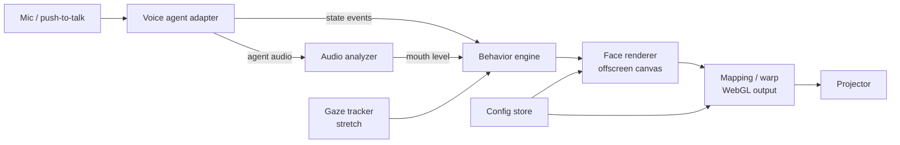

# Projected Talking Head — Build Spec

2026-09-18 (original) · revised 2026-09-19 to match the implementation

## Changes from the original spec

The original spec follows below unchanged. These are the deliberate departures in the code:

- **No WebGL.** The output stage is Canvas 2D (transform, flips, ellipse mask, hotspot) plus a CSS `matrix3d` on the canvas element for the corner pin. `matrix3d` is a true projective transform, GPU-composited, so straight lines stay straight and the whole warp stage is about 100 lines. The mesh warp (M5) is dropped unless the mask turns out to need it; the 2D transform plus a homography plus face layout sliders cover a flat or gently curved mask.
- **Echo test agent.** Besides `MicLoopAgent`, an `EchoAgent` records while talk is held and plays it back as the agent's voice. It exercises listening → thinking → speaking → idle with zero API calls, so the whole loop can be tuned on a plane or with no credit.
- **Thinking state is derived client-side.** ElevenLabs only reports `listening`/`speaking`. `thinking` = talk released and no agent audio yet (capped at 8 s); `connecting` shows a shimmer so a visitor's first press never looks dead.
- **Deliberate disconnects look idle.** The dim "disconnected" face only appears when a wanted session dropped. Ending a session after the idle timeout shows the normal idle face.
- **Screen wake lock** is held in show mode; without it the display sleeps in under an hour on most laptops.
- **Right mouse button is a second talk button**, so a cheap presenter clicker or a mouse with a long cable works without a footswitch.
- **Output gamma** is dropped (not expressible in Canvas 2D cheaply); brightness and hotspot compensation remain.
- **Painting mode.** A reference-photo underlay (edit mode only), per-feature visibility toggles, and an optional light-wash layer let the same app map onto a flat painting whose pale regions the projector animates.
- **Gaze tracking (M6)** stays a stretch goal; the behavior engine already accepts an external gaze target.

---

## Overview

Build a single-page browser app that renders a stylized, glowing AI face on pure black, runs fullscreen through a projector onto a white mask, and holds a live voice conversation with visitors at an embodied-AI event. Build window: about 2 days, so ship the core loop first and treat mapping tools and gaze tracking as stretch goals.

**Goals**

- A visitor speaks, the head answers aloud within about 1 second, and the mouth moves in sync with its voice.
- The face feels alive when nobody is talking: blinks, eye drift, subtle breathing.
- The face can be positioned and warped in the browser to fit a physical mask (stretch).
- It runs unattended for hours without crashing or needing a keyboard.

**Non-goals**

- Photoreal faces, true phoneme-level lip sync, 3D scanning or projector calibration math beyond a 2D warp.
- Building our own speech-to-text, LLM or TTS pipeline. We use a hosted realtime voice agent.
- Multi-user conversations or visitor accounts.

## Architecture & tech stack

The app is a Vite + TypeScript single page with no UI framework: the face draws to an offscreen 2D canvas, a WebGL output stage warps it onto the projector, and a voice-agent adapter feeds audio levels and conversation state into a behavior engine.



Each box is one module with a small typed interface, so providers and renderers can be swapped.

| Module | Responsibility |
| --- | --- |
| `agent/` | Connect to the voice provider, expose `state` (idle, listening, thinking, speaking), the agent's output audio as a `MediaStream` or level getter, and `start/stop/mute`. |
| `audio/analyzer.ts` | `AnalyserNode` on the agent output; returns smoothed level 0–1 and a rough brightness value per frame. |
| `behavior/` | Pure function of time, state, audio level and gaze target → a `FaceParams` object (eye openness, pupil offset, brow height, mouth open/width, glow). |
| `face/renderer.ts` | Draws `FaceParams` to a 1024×1024 offscreen canvas. No knowledge of warping. |
| `mapping/` | WebGL pass that samples the face canvas as a texture and applies transform, corner pin, mesh warp and masks. Edit-mode UI lives here. |
| `config/` | Load defaults, persist to `localStorage`, import/export JSON. |
| `gaze/` (stretch) | Webcam + MediaPipe face detection → normalized gaze target. |
| `server/` | Tiny Node/Express endpoint only if the provider needs a secret key (mints ephemeral session tokens). |

**Stack:** Vite, TypeScript, raw WebGL or `twgl.js` for the warp, `tweakpane` for the edit panel, `@mediapipe/tasks-vision` for gaze. Serve on `localhost` so the mic works without HTTPS. Target Chrome on a laptop driving the projector as a second display.

## Voice agent integration

Use a hosted realtime voice agent behind a provider-agnostic adapter; implement ElevenLabs Conversational AI first (no backend needed for a public agent) and OpenAI Realtime over WebRTC second. The code agent should verify exact SDK method names against current docs before wiring them.

**Adapter interface**

```ts
interface VoiceAgent {
  connect(): Promise<void>;
  disconnect(): Promise<void>;
  setMicEnabled(on: boolean): void;
  getOutputLevel(): number;        // 0..1, polled each frame
  onState(cb: (s: AgentState) => void): void;
  onError(cb: (e: Error) => void): void;
}
type AgentState = 'disconnected' | 'idle' | 'listening' | 'thinking' | 'speaking';
```

**Provider notes**

- **ElevenLabs:** use the `@elevenlabs/client` browser SDK with an agent ID. Map its mode/status callbacks to `AgentState`, and use its output volume or frequency-data getter for the mouth. Persona, voice and first message are set in the ElevenLabs dashboard.
- **OpenAI Realtime:** WebRTC connection using an ephemeral token from `server/` (never ship the API key to the browser). Pipe the remote audio `MediaStream` into an `AnalyserNode` for levels. Derive `speaking` from output audio events and `listening` from server VAD events.
- **Fallback test source:** a `MicLoopAgent` that drives the mouth from the local mic, so face work can proceed before any provider is wired.

**Turn-taking**

- Default mode is push-to-talk: hold Space (or a USB footswitch / presenter clicker mapped to a key) to unmute the mic. This is far more reliable than open-mic VAD in a loud room.
- Optional open-mic mode with provider VAD, selectable in config.
- Barge-in: pressing talk while the agent is speaking interrupts it (provider-supported interruption).

**Persona**

- Keep the system prompt in `config/persona.md` (or the provider dashboard) so it can change without code.
- Replies 1–3 sentences, spoken style, no lists or markdown, asks the visitor a question back often.
- It knows it is a projected head at an embodied-AI event and can refer to its own body playfully.

## Face design & animation

The face is a minimal glowing line drawing on pure black (black projects as nothing, so only the face lands on the mask); its liveliness comes from idle behaviors more than lip accuracy.

**Visual style**

- Canvas: 1024×1024 offscreen, face centered, origin at canvas center, units in pixels.
- Strokes: 3–6 px lines with additive glow (`shadowBlur` 10–30 or a two-pass blur), one configurable hue (default cyan-white). Global glow and brightness sliders.
- Features: two eyes (almond outline + filled pupil), two brows (single arcs), mouth (upper and lower lip curves meeting at corners), optional faint nose hint and optional face contour (off by default, since the mask provides the contour).
- Feature layout params: eye spacing, eye Y, eye size, mouth Y, mouth width, brow offset. These let the face match the mask's physical features before any warping.
- Optional ambient layer: a few slow drifting particles or a faint scanline shimmer, used mainly in the thinking state.

**Mouth from audio**

- `mouthOpen` = agent output level through a noise gate (default 0.05), then an envelope follower with ~40 ms attack and ~120 ms release, mapped with a gamma of about 0.7 so quiet speech still moves.
- `mouthWidth` shrinks slightly as spectral brightness rises (a crude oo/ee variation). Clamp all values.
- Small random jitter (±5%) while speaking so it never looks mechanical.

**Behavior states**

| State | Eyes | Brows | Mouth | Extra |
| --- | --- | --- | --- | --- |
| idle | Slow drift, saccade every 1–3 s | Neutral | Closed, faint breathing | Glow breathes on a ~4 s cycle |
| listening | Hold on visitor (gaze target or center), pupils +10% | Raised slightly | Closed | Glow brightens a little |
| thinking | Glance up and to one side | Slight furrow | Closed | Shimmer or particles on |
| speaking | Mostly on visitor, occasional glance away | Lift on loud peaks | Driven by audio | — |
| disconnected | Half-lidded | Low | Closed | Dim to 40% |

**Timing details**

- Blinks: random interval 2–6 s, ~150 ms duration (fast close, slower open), 15% chance of a double blink. Blink on each state change.
- Saccades: move to a new target in ~50 ms, then hold; target offsets stay within 30% of eye radius.
- All transitions between states ease over 200–400 ms. Nothing snaps.

## Mapping tools (stretch)

The output stage is one WebGL pass that takes the face canvas as a texture and applies, in order, a basic transform, a 4-corner pin, a mesh warp, then masks and brightness; each stage is optional and defaults to identity.

**Warp stages**

1. **Transform:** translate X/Y, uniform scale, non-uniform scale X/Y, rotation, flip horizontal, flip vertical. Flip H is required for rear projection and must be one keypress.
2. **Corner pin:** four draggable corners with a true homography (compute the 3×3 matrix from the 4 point pairs; do not fake it with bilinear interpolation, which bends straight lines).
3. **Mesh warp:** an N×M control-point grid (default 4×4, adjustable 2×2 to 8×8) over the face. Render a finely subdivided plane (e.g. 64×64 quads) whose vertex positions are interpolated from the control points with Catmull-Rom or bicubic interpolation, so the warp stays smooth. Changing grid size resamples the current warp rather than resetting it.
4. **Masks:** a feathered ellipse mask (center, radii, feather) to cut spill beyond the mask edge, plus an optional custom polygon mask with draggable points.
5. **Output correction:** global brightness, gamma, and a radial hotspot compensation (center, radius, strength) that dims the middle to even out rear-projection falloff.

**Edit mode**

- Toggle with `E`. In show mode, nothing but the face is visible and the cursor is hidden.
- Edit mode overlays: the active stage's handles, grid lines, and an optional test pattern (white grid + crosshair + circle) toggled with `T`, used to align against the physical mask in a dark room.
- Mouse: click a handle to select, drag to move; shift-click to multi-select; drag on empty space to marquee-select mesh points.
- Keyboard: arrows nudge selection 1 px, Shift+arrows 10 px. `1`–`5` switch active stage. `R` resets the active stage. `Ctrl+Z` / `Ctrl+Shift+Z` undo/redo (a simple snapshot stack of the mapping config, 50 steps).
- A `tweakpane` panel shows numeric values for every param, face layout params, glow/color, agent mode, and buttons for export/import.

**Keyboard map**

| Key | Action |
| --- | --- |
| Space (hold) | Push to talk |
| E | Toggle edit mode |
| T | Toggle test pattern |
| F | Toggle fullscreen |
| H / V | Flip horizontal / vertical |
| 1–5 | Transform / corner pin / mesh / masks / output |
| Arrows (+Shift) | Nudge selection 1 / 10 px |
| R | Reset active stage |
| Ctrl+Z / Ctrl+Shift+Z | Undo / redo |
| Ctrl+S | Export config JSON |
| Ctrl+1–3 / Alt+1–3 | Save / load preset slot |

**Persistence**

- Autosave the full config to `localStorage` 500 ms after any change.
- Three named preset slots (e.g. per venue or per mask).
- Export/import as a JSON file so a working setup can be backed up before the event.

## Show mode & robustness

In show mode the app must survive hours unattended: the face never disappears, errors never appear on the projection, and dropped connections recover on their own.

- **Launch:** one click on a "Start" overlay (needed for the browser's audio/mic permission), then fullscreen and cursor hidden. Document a Chrome kiosk launch command in the README.
- **Session lifecycle:** connect when a visitor first presses talk (or on start in open-mic mode). End the session after 45 s of no speech from either side and return to idle, which limits cost and clears context between visitors. Idle animation keeps running while disconnected.
- **Reconnect:** on disconnect or error, retry with backoff (1 s, 2 s, 5 s, then every 10 s). The face shows the `disconnected` state, never an error message.
- **Error surface:** errors log to the console and to a small panel visible only in edit mode.
- **Performance:** hold 60 fps on a mid-range laptop; the face canvas redraws once per frame, and the warp mesh only rebuilds when mapping params change.
- **Attract mode (optional):** when idle for over 60 s, an occasional slow glance around and brightening glow to draw people in. With gaze tracking on, it looks at approaching visitors.
- **Gaze tracking (stretch):** 320×240 webcam feed into MediaPipe face detection at ~15 fps. Pick the largest face, map its center to a pupil offset (with configurable inversion and gain), smooth over ~200 ms, and fall back to idle drift when no face is seen for 2 s.

## Config schema

All tunable values live in one versioned JSON object; this example shows the defaults.

```json
{
  "version": 1,
  "agent": {
    "provider": "elevenlabs",
    "agentId": "",
    "turnMode": "pushToTalk",
    "sessionIdleTimeoutSec": 45
  },
  "face": {
    "color": "#bff6ff",
    "lineWidth": 4,
    "glow": 20,
    "brightness": 1.0,
    "layout": { "eyeSpacing": 220, "eyeY": -80, "eyeSize": 70, "browOffset": 60, "mouthY": 170, "mouthWidth": 200 },
    "showNose": false,
    "showContour": false
  },
  "mouth": { "gate": 0.05, "attackMs": 40, "releaseMs": 120, "gamma": 0.7 },
  "behavior": { "blinkMinSec": 2, "blinkMaxSec": 6, "doubleBlinkChance": 0.15 },
  "mapping": {
    "transform": { "x": 0, "y": 0, "scale": 1, "scaleX": 1, "scaleY": 1, "rotation": 0, "flipH": false, "flipV": false },
    "cornerPin": [[0,0],[1,0],[1,1],[0,1]],
    "mesh": { "cols": 4, "rows": 4, "points": [] },
    "ellipseMask": { "enabled": false, "cx": 0.5, "cy": 0.5, "rx": 0.45, "ry": 0.5, "feather": 0.05 },
    "polygonMask": { "enabled": false, "points": [] },
    "output": { "brightness": 1, "gamma": 1, "hotspot": { "enabled": false, "cx": 0.5, "cy": 0.5, "radius": 0.4, "strength": 0.3 } }
  },
  "gaze": { "enabled": false, "invertX": true, "gainX": 1, "gainY": 0.6 }
}
```

Mapping coordinates are normalized 0–1 in output space; an empty `mesh.points` means an identity grid. Include a `version` migration hook so old exported files still load.

## Milestones & acceptance criteria

Build in this order and stop wherever time runs out; M1–M3 are the must-haves for the event, M4–M6 are stretch.

| # | Milestone | Done when |
| --- | --- | --- |
| M1 | Face + mic loop | Face renders fullscreen on black; `MicLoopAgent` moves the mouth from your own voice; blinks and eye drift run. |
| M2 | Voice agent | Holding Space lets you talk to the agent; the reply plays within ~1 s and the mouth tracks its audio; states switch visibly. |
| M3 | Show-ready | Start overlay, fullscreen, hidden cursor, session timeout, auto-reconnect, and 1 hour unattended with no crash. |
| M4 | Transform + corner pin | Face can be moved, scaled, rotated, flipped and corner-pinned in edit mode; config persists across reloads. |
| M5 | Mesh warp + masks | 4×4 mesh warp stays smooth, ellipse mask and hotspot compensation work, export/import round-trips. |
| M6 | Gaze tracking | Pupils follow the nearest visitor and fall back to drift when nobody is in view. |

**Global acceptance checks**

- No visible errors, UI or cursor on the projection in show mode.
- Reloading the page restores the exact mapping and face layout.
- Unplugging the network for 30 s, then restoring it, recovers without touching the laptop.
- Deliver a README with setup, API key/agent ID configuration, kiosk launch command and the keyboard map.

## Physical setup notes & open decisions

The software assumes a laptop driving a projector as a second display, aimed at a thin white mask from behind (flip H on) or a styrofoam head from the front (flip H off).

- **Mask:** blank white plastic craft mask, inside lightly sanded for diffusion. Fallback: white styrofoam wig head, front-projected from low and close.
- **Projector:** any small projector; a face-sized surface in a dim booth needs only about 500–1000 lumens. Block light spill with black fabric around the rig.
- **Audio:** handheld or directional mic into the laptop; speaker placed in or directly behind the head so the voice comes from the face.
- **Talk button:** USB footswitch or presenter clicker mapped to Space, mounted on the plinth.
- **Webcam (stretch):** centered just below the mask, pointed at the visitor zone.

**Open decisions**

- [ ] Voice provider: ElevenLabs (fastest to wire) or OpenAI Realtime (needs the token server).
- [ ] Persona and first line the head says when someone approaches.
- [ ] Face color and whether to show a faint face contour.
- [ ] Rear projection on the plastic mask or front projection on the foam head.
